```mermaid
graph TB
    subgraph "Client Layer"
        A[React Web App<br/>Port: 5173]
        B[Electron Desktop<br/>Optional]
    end
    
    subgraph "API Gateway"
        C[NestJS Backend<br/>Port: 3001]
        D[REST API]
        E[WebSocket Support]
        F[Swagger Docs]
    end
    
    subgraph "AI Engine"
        G[Ollama Server<br/>Port: 11434]
        H[Local AI Models]
        I[MCP Integration<br/>Future]
    end
    
    subgraph "Infrastructure"
        J[Docker Compose]
        K[Nginx Proxy<br/>Optional]
        L[Monitoring<br/>Future]
    end
    
    A --> D
    B --> D
    D --> C
    C --> G
    E --> C
    F --> C
    G --> H
    J --> A
    J --> C
    J --> G
    
    style A fill:#61dafb
    style C fill:#e0234e
    style G fill:#000000
    style J fill:#2496ed
```

# 🧠 ExpertMind - AI-Powered Chat Application

<div align="center">


**An Enterprise-Grade Monorepo Chat Application with Local AI Integration**

[](https://react.dev/)
[](https://nestjs.com/)
[](https://www.typescriptlang.org/)
[](https://www.docker.com/)
[](https://ollama.ai/)
[](https://www.electronjs.org/)
[](https://github.com/modelcontextprotocol)

</div>

## 🌟 Overview

ExpertMind is a cutting-edge, privacy-focused chat application that brings the power of AI directly to your local environment. Built as a professional monorepo architecture, it combines a modern React frontend with a robust NestJS backend, all seamlessly integrated with Ollama for local AI model execution.

### 🎯 Key Value Propositions

- **🔒 Complete Privacy**: All AI processing happens locally - your conversations never leave your machine
- **🚀 Enterprise Architecture**: Production-ready monorepo setup with scalable microservices design
- **💻 Cross-Platform**: Web-based interface with Electron packaging capability for desktop apps
- **🔌 MCP Ready**: Prepared for Model Context Protocol integration for enhanced AI capabilities
- **🏢 Professional Grade**: Built with enterprise standards, comprehensive testing, and documentation

## 📐 Architecture Overview



### 🏗️ Technology Stack

<table>
<tr>
<td>

#### Frontend
- **Framework**: React 18 with TypeScript
- **Build Tool**: Vite for lightning-fast HMR
- **UI Components**: Custom components with Lucide icons
- **State Management**: React Hooks & Context API
- **Desktop**: Electron packaging ready
- **Styling**: Modern CSS with responsive design

</td>
<td>

#### Backend
- **Framework**: NestJS with TypeScript
- **API**: RESTful with OpenAPI/Swagger
- **HTTP Client**: Axios with RxJS integration
- **Configuration**: @nestjs/config for env management
- **Validation**: class-validator & class-transformer
- **Documentation**: Auto-generated Swagger UI

</td>
</tr>
<tr>
<td>

#### AI Integration
- **Engine**: Ollama for local model execution
- **Models**: TinyLlama (default), Llama2, Mistral
- **Processing**: 100% on-device computation
- **API**: Native Ollama REST interface
- **MCP**: Model Context Protocol ready
- **Privacy**: Zero cloud dependencies

</td>
<td>

#### DevOps & Infrastructure
- **Containerization**: Docker & Docker Compose
- **Package Manager**: Yarn Workspaces
- **Version Control**: Git with conventional commits
- **CI/CD**: GitHub Actions ready
- **Monitoring**: Health checks & logging
- **Development**: Hot reload on all services

</td>
</tr>
</table>

## 🚀 Quick Start

### Prerequisites

<table>
<tr>
<td>

```bash
# Required versions
node >= 18.0.0
yarn >= 1.22.0
docker >= 20.10
docker-compose >= 2.0
```

</td>
<td>

```bash
# Check installations
node --version
yarn --version
docker --version
docker compose version
```

</td>
</tr>
</table>

### 🎬 Installation

```bash
# 1. Clone the repository
git clone <repository-url>
cd expertmind-monorepo

# 2. Install dependencies
yarn install

# 3. Start all services (recommended)
yarn dev

# The first run will download the AI model (3-5 minutes)
# Monitor the download progress:
yarn docker:logs -f ollama
```

### 🌐 Access Points

| Service | URL | Description |
|---------|-----|-------------|
| 🌐 **Web Application** | [http://localhost:5173](http://localhost:5173) | Main chat interface |
| 🔧 **Backend API** | [http://localhost:3001](http://localhost:3001) | REST API endpoints |
| 📚 **API Documentation** | [http://localhost:3001/api](http://localhost:3001/api) | Interactive Swagger UI |
| 🤖 **Ollama API** | [http://localhost:11434](http://localhost:11434) | AI model server |

## 💻 Development Guide

### 🛠️ Development Modes

#### 1. **Full Docker Development** (Recommended)
Perfect for getting started quickly with all services containerized.

```bash
# Start everything with Docker
yarn dev

# Or use the full docker mode explicitly
yarn dev:full
```

#### 2. **Hybrid Development**
Best for active development with hot reload on frontend/backend while keeping Ollama stable in Docker.

```bash
# Terminal 1: Start Ollama in Docker
yarn dev:ollama-only

# Terminal 2: Start frontend and backend locally
yarn dev:local
```

#### 3. **Individual Service Development**
For focused development on specific components.

```bash
# Frontend only (http://localhost:5173)
yarn dev:frontend

# Backend only (http://localhost:3001)
yarn dev:backend

# View Docker logs
yarn docker:logs
yarn docker:logs:ollama
yarn docker:logs:backend
```

### 📝 Available Scripts

<details>
<summary><b>🔧 Development Scripts</b></summary>

```bash
# Main development commands
yarn dev                 # Start all services with Docker
yarn dev:local          # Start frontend + backend locally
yarn dev:ollama-only    # Start only Ollama in Docker
yarn dev:frontend       # Start only frontend
yarn dev:backend        # Start only backend

# Building
yarn build              # Build all workspaces
yarn build:frontend     # Build frontend only
yarn build:backend      # Build backend only

# Testing & Quality
yarn test               # Run all tests
yarn lint               # Lint all workspaces
yarn type-check         # TypeScript validation
yarn clean              # Clean all build artifacts
```

</details>

<details>
<summary><b>🐳 Docker Management</b></summary>

```bash
# Container management
yarn docker:up          # Start Docker services
yarn docker:down        # Stop Docker services
yarn docker:rebuild     # Rebuild and restart
yarn docker:status      # Check service status

# Logging
yarn docker:logs        # View all logs
yarn docker:logs:ollama # Ollama logs only
yarn docker:logs:backend # Backend logs only

# Model management
yarn docker:models      # List installed models
yarn docker:pull-gemma  # Download Gemma model
yarn docker:pull-tinyllama # Download TinyLlama

# Diagnostics
yarn diagnostico        # Run diagnostic script
yarn docker:test        # Test Ollama connection
```

</details>

## 📁 Project Structure

```
expertmind-monorepo/
├── 📁 apps/                        # Application packages
│   ├── 📁 frontend/                # React application
│   │   ├── 📁 src/
│   │   │   ├── 📁 components/      # React components
│   │   │   │   ├── ChatArea.tsx   # Main chat interface
│   │   │   │   ├── MessageInput.tsx
│   │   │   │   ├── MessageList.tsx
│   │   │   │   └── Sidebar.tsx
│   │   │   ├── 📁 utils/           # Utility functions
│   │   │   │   ├── api.ts          # API client
│   │   │   │   ├── database.ts     # LocalStorage manager
│   │   │   │   └── fileUtils.ts    # File handling
│   │   │   ├── 📁 types/           # TypeScript definitions
│   │   │   ├── App.tsx             # Root component
│   │   │   └── main.tsx            # Entry point
│   │   ├── 📄 package.json
│   │   ├── 📄 vite.config.ts       # Vite configuration
│   │   ├── 📄 tsconfig.json
│   │   └── 📄 Dockerfile
│   │
│   └── 📁 backend/                 # NestJS API
│       ├── 📁 src/
│       │   ├── 📁 ollama/          # Ollama integration module
│       │   │   ├── 📁 dto/         # Data transfer objects
│       │   │   ├── ollama.controller.ts
│       │   │   ├── ollama.service.ts
│       │   │   └── ollama.module.ts
│       │   ├── 📁 config/          # Configuration module
│       │   ├── app.module.ts       # Root module
│       │   └── main.ts             # Bootstrap file
│       ├── 📁 test/                # Test files
│       ├── 📄 package.json
│       ├── 📄 nest-cli.json
│       ├── 📄 tsconfig.json
│       └── 📄 Dockerfile
│
├── 📁 scripts/                     # Utility scripts
│   ├── check-docker.sh
│   ├── diagnostico.sh
│   └── setup-scripts.sh
│
├── 📄 docker-compose.yml           # Main Docker configuration
├── 📄 docker-compose.ollama-only.yml
├── 📄 docker-compose.debug.yml
├── 📄 package.json                 # Root package.json
├── 📄 yarn.lock                    # Dependency lock file
├── 📄 .gitignore
└── 📄 README.md                    # This file
```

## 🔌 API Documentation

### Core Endpoints

<details>
<summary><b>🏥 Health & Status</b></summary>

```typescript
// Service health check
GET /health
Response: { status: 'ok', timestamp: '2025-01-20T10:00:00Z' }

// Ollama connection status
GET /ollama/status
Response: { 
  connected: true, 
  version: '0.1.0',
  models: ['tinyllama']
}
```

</details>

<details>
<summary><b>🤖 AI Model Management</b></summary>

```typescript
// List available models
GET /ollama/models
Response: {
  models: [
    { name: 'tinyllama', size: '637MB', modified: '2025-01-20' }
  ]
}

// Download new model
POST /ollama/pull/:modelName
Response: { 
  status: 'downloading',
  progress: 45,
  total: 637000000
}
```

</details>

<details>
<summary><b>💬 Chat Operations</b></summary>

```typescript
// Conversational chat
POST /ollama/chat
Body: {
  model: 'tinyllama',
  messages: [
    { role: 'system', content: 'You are a helpful assistant' },
    { role: 'user', content: 'Hello, how are you?' }
  ],
  options: {
    temperature: 0.7,
    top_p: 0.9
  }
}

// Simple generation
POST /ollama/generate
Body: {
  model: 'tinyllama',
  prompt: 'Explain quantum computing',
  options: {
    temperature: 0.8,
    max_tokens: 500
  }
}
```

</details>

### 🧪 Testing the API

```bash
# Quick health check
curl http://localhost:3001/health

# List models
curl http://localhost:3001/ollama/models

# Test chat endpoint
curl -X POST http://localhost:3001/ollama/chat \
  -H "Content-Type: application/json" \
  -d '{
    "model": "tinyllama",
    "messages": [
      {"role": "user", "content": "What is TypeScript?"}
    ]
  }'

# Interactive API documentation
open http://localhost:3001/api
```

## 🤖 AI Models Configuration

### Default Model

**TinyLlama** - A lightweight model perfect for development and testing
- Size: ~637MB
- Performance: Fast responses, low memory usage
- Use case: General chat, basic queries

### Additional Models

| Model | Size | Description | Install Command |
|-------|------|-------------|-----------------|
| **Llama 2** | ~3.8GB | Meta's powerful language model | `yarn docker:exec ollama pull llama2` |
| **Code Llama** | ~3.8GB | Specialized for code generation | `yarn docker:exec ollama pull codellama` |
| **Mistral** | ~4.1GB | Fast and efficient model | `yarn docker:exec ollama pull mistral` |
| **Phi-2** | ~1.6GB | Microsoft's compact model | `yarn docker:exec ollama pull phi` |
| **Gemma 2B** | ~1.4GB | Google's efficient model | `yarn docker:pull-gemma` |

### Model Management

```bash
# List installed models
yarn docker:models

# Download a specific model
curl -X POST http://localhost:3001/ollama/pull/mistral

# Switch models in the UI
# Simply select from the dropdown in the chat interface
```

## ⚙️ Configuration

### Environment Variables

<details>
<summary><b>Frontend Configuration</b></summary>

Create `apps/frontend/.env`:

```env
# API Configuration
VITE_API_URL=http://localhost:3001
VITE_WS_URL=ws://localhost:3001

# Development
VITE_PORT=5173
VITE_HOST=localhost

# Feature Flags
VITE_ENABLE_FILE_UPLOAD=true
VITE_ENABLE_VOICE_INPUT=false
VITE_ENABLE_MCP=false
```

</details>

<details>
<summary><b>Backend Configuration</b></summary>

Create `apps/backend/.env`:

```env
# Server Configuration
NODE_ENV=development
PORT=3001

# Ollama Configuration
OLLAMA_URL=http://localhost:11434
# For Docker: OLLAMA_URL=http://ollama:11434

# CORS
CORS_ORIGIN=http://localhost:5173

# API Limits
MAX_REQUEST_SIZE=10mb
RATE_LIMIT_MAX=100
RATE_LIMIT_WINDOW=900000

# Future: MCP Configuration
ENABLE_MCP=false
MCP_SERVER_URL=
```

</details>

## 🚀 Production Deployment

### Building for Production

```bash
# Build everything
yarn build

# Frontend build output: apps/frontend/dist/
# Backend build output: apps/backend/dist/

# Create production Docker images
docker build -t expertmind-frontend ./apps/frontend
docker build -t expertmind-backend ./apps/backend
```

### Deployment Options

<table>
<tr>
<td>

#### 🌐 Cloud Deployment
- **Frontend**: Vercel, Netlify, Cloudflare Pages
- **Backend**: Railway, Render, Fly.io
- **Full Stack**: DigitalOcean, AWS ECS, Google Cloud Run

</td>
<td>

#### 🏠 Self-Hosted
- **Single VPS**: Docker Compose setup
- **Kubernetes**: Helm charts available
- **Desktop**: Electron package for offline use

</td>
</tr>
</table>

### Production Docker Compose

```yaml
# docker-compose.prod.yml
version: '3.8'

services:
  frontend:
    image: expertmind-frontend:latest
    ports:
      - "80:80"
    environment:
      - VITE_API_URL=https://api.yourdomain.com

  backend:
    image: expertmind-backend:latest
    ports:
      - "3001:3001"
    environment:
      - NODE_ENV=production
      - OLLAMA_URL=http://ollama:11434

  ollama:
    image: ollama/ollama:latest
    volumes:
      - ollama-data:/root/.ollama
    ports:
      - "11434:11434"

volumes:
  ollama-data:
```

## 🔍 Monitoring & Debugging

### Health Monitoring

```bash
# Check all services
curl http://localhost:3001/health
curl http://localhost:11434/api/tags
curl http://localhost:5173

# Monitor resource usage
docker stats

# View detailed logs
yarn docker:logs -f --tail=100
```

### Performance Optimization

1. **Frontend**
   - Code splitting with React.lazy()
   - Image optimization
   - Service Worker for offline capability

2. **Backend**
   - Request caching
   - Database connection pooling
   - Rate limiting

3. **AI Models**
   - Model quantization for faster inference
   - GPU acceleration (if available)
   - Response streaming

## 🐛 Troubleshooting

<details>
<summary><b>Common Issues & Solutions</b></summary>

### 🔴 Ollama Connection Failed
```bash
# Check if Ollama is running
docker ps | grep ollama

# Restart Ollama
docker compose restart ollama

# Check Ollama logs
yarn docker:logs:ollama --tail=50

# Test direct connection
curl http://localhost:11434/api/tags
```

### 🔴 Port Already in Use
```bash
# Find and kill process using port
lsof -ti:5173 | xargs kill -9  # Frontend
lsof -ti:3001 | xargs kill -9  # Backend
lsof -ti:11434 | xargs kill -9 # Ollama

# Or change ports in docker-compose.yml
```

### 🔴 Model Download Stuck
```bash
# Check download progress
yarn docker:logs:ollama -f

# Manually restart download
docker compose exec ollama ollama pull tinyllama

# Clear and retry
docker compose down
docker volume prune
docker compose up -d
```

### 🔴 Frontend Can't Connect to Backend
```bash
# Verify backend is running
curl http://localhost:3001/health

# Check CORS settings
# Ensure VITE_API_URL matches backend URL

# Check browser console for errors
# Open DevTools > Network tab
```

### 🔴 Out of Memory
```bash
# Check Docker memory limits
docker system df
docker stats

# Increase Docker memory
# Docker Desktop > Settings > Resources > Memory

# Use smaller AI model
yarn docker:pull-tinyllama
```

</details>

## 🚧 Roadmap

### Phase 1: Core Features ✅
- [x] Monorepo setup with Yarn workspaces
- [x] React frontend with chat interface
- [x] NestJS backend with Ollama integration
- [x] Docker containerization
- [x] Basic chat functionality
- [x] File upload support

### Phase 2: Enhanced Features 🚀
- [ ] Model Context Protocol (MCP) integration
- [ ] Electron desktop application
- [ ] Voice input/output support
- [ ] Multi-language support
- [ ] Chat history search
- [ ] Export conversations

### Phase 3: Enterprise Features 🏢
- [ ] User authentication & authorization
- [ ] Multi-user support
- [ ] Admin dashboard
- [ ] Analytics & monitoring
- [ ] Plugin system
- [ ] Kubernetes deployment

### Phase 4: Advanced AI 🧠
- [ ] RAG (Retrieval Augmented Generation)
- [ ] Custom model fine-tuning
- [ ] Multi-modal support (images, documents)
- [ ] Agent capabilities
- [ ] Tool use and function calling
- [ ] Streaming responses

## 🤝 Contributing

We welcome contributions! Please see our [Contributing Guide](CONTRIBUTING.md) for details.

### Development Workflow

```bash
# 1. Fork and clone
git clone https://github.com/YOUR_USERNAME/expertmind-monorepo.git

# 2. Create feature branch
git checkout -b feature/amazing-feature

# 3. Install and develop
yarn install
yarn dev

# 4. Test your changes
yarn test
yarn lint

# 5. Commit with conventional commits
git commit -m "feat: add amazing feature"

# 6. Push and create PR
git push origin feature/amazing-feature
```

### Code Standards

- 📝 **Commits**: Follow [Conventional Commits](https://conventionalcommits.org/)
- 🧪 **Testing**: Maintain > 80% coverage
- 📚 **Documentation**: Update docs for new features
- 🎨 **Code Style**: Use ESLint & Prettier configs

## 📜 License

This project is licensed under the **MIT License** - see the [LICENSE](LICENSE) file for details.

## 👥 Team & Acknowledgments

### Created By
- **Dario Vega** - Lead Developer

### Special Thanks
- [Ollama](https://ollama.ai/) - For democratizing local AI
- [NestJS](https://nestjs.com/) - For the amazing backend framework
- [React](https://react.dev/) - For the powerful UI library
- [Vite](https://vitejs.dev/) - For the blazing fast build tool

---

<div align="center">

### ⭐ Star us on GitHub!

If you find ExpertMind helpful, please consider giving us a star. It helps us reach more developers!

[](https://github.com/YOUR_USERNAME/expertmind-monorepo)
[](https://twitter.com/YOUR_TWITTER)

**Made with ❤️ and lots of ☕**

</div>
