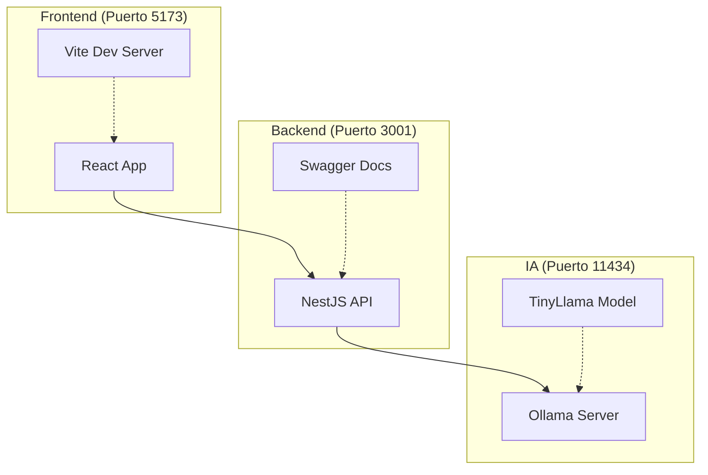

# 🤖 ExpertMind - Aplicación Web de Chat con IA

> **Aplicación web completa de chatbox con inteligencia artificial, desarrollada con React y NestJS, integrada con Ollama para modelos de IA locales.**


## 📖 Descripción

ExpertMind es una aplicación web moderna que permite chatear con modelos de inteligencia artificial de manera local y privada. Utiliza Ollama para ejecutar modelos como TinyLlama sin necesidad de conexión a internet, garantizando la privacidad de tus conversaciones.

### ✨ Características Principales

- 🤖 **Chat con IA Local** - Conversaciones con modelos de IA ejecutándose localmente
- 🏠 **100% Privado** - Todos los datos permanecen en tu máquina
- 📱 **Interfaz Moderna** - UI responsiva con modo oscuro
- 📎 **Soporte de Archivos** - Subida de imágenes y documentos
- 💾 **Almacenamiento Local** - Historial de conversaciones en localStorage
- 🔄 **Múltiples Sesiones** - Gestión de múltiples conversaciones
- 🐳 **Docker Ready** - Setup completo con contenedores
- 📚 **API Documentada** - Swagger para desarrollo
- ⚡ **Desarrollo Rápido** - Hot reload en frontend y backend

## 🏗️ Arquitectura



### 🛠️ Stack Tecnológico

| Componente | Tecnología | Descripción |
|------------|------------|-------------|
| **Frontend** | React 18 + TypeScript | Interfaz de usuario moderna y reactiva |
| **Build Tool** | Vite | Desarrollo rápido con hot reload |
| **Backend** | NestJS + TypeScript | API REST robusta y escalable |
| **IA Engine** | Ollama + TinyLlama | Procesamiento de IA local |
| **Almacenamiento** | localStorage | Persistencia de datos en navegador |
| **Contenedores** | Docker Compose | Orquestación completa de servicios |
| **Documentación** | Swagger/OpenAPI | API documentada automáticamente |

## 🚀 Inicio Rápido

### Prerrequisitos

```bash
# Verificar versiones requeridas
node --version  # >= 18.0.0
yarn --version  # >= 1.22.0
docker --version
docker-compose --version
```

### Instalación con Docker (Recomendado)

```bash
# 1. Clonar el repositorio
git clone <url-del-repositorio>
cd expertmind-monorepo

# 2. Instalar dependencias
yarn install

# 3. Levantar todos los servicios
yarn dev

# 4. Esperar a que descargue TinyLlama (3-5 minutos la primera vez)
yarn docker:logs:ollama

# 5. Verificar que todo esté funcionando
curl http://localhost:3001/health
```

### URLs de la Aplicación

| Servicio | URL | Descripción |
|----------|-----|-------------|
| 🌐 **Frontend** | http://localhost:5173 | Interfaz principal de la aplicación |
| 🔧 **Backend API** | http://localhost:3001 | API REST del backend |
| 📚 **Documentación** | http://localhost:3001/api | Swagger UI con documentación interactiva |
| 🤖 **Ollama** | http://localhost:11434 | Servidor de IA (solo API) |

## 💻 Desarrollo Local

### Opción 1: Todo con Docker
```bash
yarn dev  # Levanta frontend + backend + ollama
```

### Opción 2: Desarrollo Híbrido
```bash
# Terminal 1: Servicios base
yarn docker:up

# Terminal 2: Backend en desarrollo
yarn dev:backend

# Terminal 3: Frontend en desarrollo  
yarn dev:frontend
```

### Opción 3: Completamente Local
```bash
# Requisito: Ollama instalado localmente
# Ver: https://ollama.ai/download

# Terminal 1: Ollama
ollama serve
ollama pull tinyllama

# Terminal 2: Backend
cd apps/backend
yarn install
yarn start:dev

# Terminal 3: Frontend
cd apps/frontend
yarn install
yarn dev
```

## 📋 Scripts Disponibles

### Scripts Principales
```bash
# Desarrollo con Docker
yarn dev                    # Levanta todos los servicios
yarn dev:local             # Frontend + Backend local (sin Docker)

# Desarrollo individual
yarn dev:frontend          # Solo frontend (puerto 5173)
yarn dev:backend           # Solo backend (puerto 3001)

# Build
yarn build                 # Construye todos los workspaces
yarn build:frontend        # Solo frontend
yarn build:backend         # Solo backend

# Testing
yarn test                  # Todas las pruebas
yarn lint                  # Análisis de código
yarn type-check            # Verificación de tipos TypeScript
```

### Scripts de Docker
```bash
# Gestión de contenedores
yarn docker:up             # Levantar servicios
yarn docker:down           # Detener servicios
yarn docker:logs           # Ver todos los logs
yarn docker:logs:backend   # Solo logs del backend
yarn docker:logs:ollama    # Solo logs de Ollama

# Limpieza
yarn clean                 # Limpia archivos build y node_modules
```

## 📁 Estructura del Proyecto

```
expertmind-monorepo/
├── 📁 apps/
│   ├── 📁 frontend/                 # Aplicación React
│   │   ├── 📁 src/
│   │   │   ├── 📁 components/       # Componentes React
│   │   │   │   ├── ChatArea.tsx
│   │   │   │   ├── MessageInput.tsx
│   │   │   │   ├── MessageList.tsx
│   │   │   │   └── Sidebar.tsx
│   │   │   ├── 📁 utils/            # Utilidades
│   │   │   │   ├── api.ts           # Gestión de API
│   │   │   │   ├── database.ts      # localStorage manager
│   │   │   │   └── fileUtils.ts     # Manejo de archivos
│   │   │   ├── 📁 types/            # Tipos TypeScript
│   │   │   └── App.tsx              # Componente principal
│   │   ├── 📄 package.json
│   │   ├── 📄 vite.config.ts
│   │   └── 📄 Dockerfile
│   └── 📁 backend/                  # API NestJS
│       ├── 📁 src/
│       │   ├── 📁 ollama/           # Módulo Ollama
│       │   │   ├── 📁 dto/          # Data Transfer Objects
│       │   │   ├── ollama.controller.ts
│       │   │   ├── ollama.service.ts
│       │   │   └── ollama.module.ts
│       │   ├── app.module.ts        # Módulo principal
│       │   └── main.ts              # Punto de entrada
│       ├── 📁 scripts/              # Scripts utiles
│       │   └── test-ollama.sh       # Pruebas de conexión
│       ├── 📄 package.json
│       ├── 📄 Dockerfile
│       └── 📄 README.md
├── 📄 docker-compose.yml           # Orquestación completa
├── 📄 package.json                 # Workspace root
└── 📄 README.md                    # Este archivo
```

## 🤖 API del Backend

### Endpoints Principales

#### Health & Status
```bash
# Estado general del servicio
GET /health
GET /

# Estado de conexión con Ollama
GET /ollama/status
```

#### Gestión de Modelos
```bash
# Listar modelos disponibles
GET /ollama/models

# Descargar un modelo específico
POST /ollama/pull/:modelName
```

#### Interacción con IA
```bash
# Chat conversacional
POST /ollama/chat
Content-Type: application/json
{
  "model": "tinyllama",
  "messages": [
    {"role": "user", "content": "Hola, ¿cómo estás?"}
  ],
  "options": {
    "temperature": 0.7
  }
}

# Generación de respuesta simple
POST /ollama/generate
Content-Type: application/json
{
  "model": "tinyllama",
  "prompt": "Explica qué es JavaScript",
  "options": {
    "temperature": 0.8
  }
}
```

### Ejemplos de Uso con curl

```bash
# Verificar que el backend está funcionando
curl http://localhost:3001/health

# Ver modelos disponibles
curl http://localhost:3001/ollama/models

# Chat simple
curl -X POST http://localhost:3001/ollama/chat \
  -H "Content-Type: application/json" \
  -d '{
    "model": "tinyllama",
    "messages": [
      {"role": "user", "content": "¿Qué es Node.js?"}
    ]
  }'

# Generar respuesta
curl -X POST http://localhost:3001/ollama/generate \
  -H "Content-Type: application/json" \
  -d '{
    "model": "tinyllama",
    "prompt": "Escribe un haiku sobre programación"
  }'

# Descargar modelo adicional
curl -X POST http://localhost:3001/ollama/pull/llama2
```

## 🐳 Docker Setup

### Servicios Incluidos

| Servicio | Puerto | Descripción |
|----------|--------|-------------|
| **frontend** | 5173 | Aplicación React con Vite |
| **backend** | 3001 | API NestJS |
| **ollama** | 11434 | Servidor Ollama |
| **ollama-setup** | - | Descarga automática de TinyLlama |

### Docker Compose

```yaml
# Ver configuración completa en docker-compose.yml
services:
  frontend:    # React app
  backend:     # NestJS API  
  ollama:      # Ollama server
  ollama-setup: # Auto-descarga TinyLlama
```

### Comandos Docker Útiles

```bash
# Rebuild completo desde cero
docker-compose down -v --remove-orphans
docker-compose build --no-cache
docker-compose up -d

# Ver recursos utilizados
docker-compose ps
docker-compose top

# Ejecutar comandos en contenedores
docker-compose exec backend yarn test
docker-compose exec frontend yarn build
docker-compose exec ollama ollama list

# Limpiar sistema Docker
docker system prune -a
docker volume prune
```

## ⚙️ Configuración

### Variables de Entorno

#### Frontend (`.env`)
```env
# URL del backend API
VITE_API_URL=http://localhost:3001

# Puerto de desarrollo (opcional)
VITE_PORT=5173
VITE_HOST=localhost
```

#### Backend (`.env`)
```env
# Configuración del servidor
PORT=3001
NODE_ENV=development

# URL de Ollama
OLLAMA_URL=http://localhost:11434
# Para Docker: OLLAMA_URL=http://ollama:11434
```

### Modelos de IA Soportados

Por defecto se incluye **TinyLlama**, pero puedes usar cualquier modelo compatible con Ollama:

| Modelo | Tamaño | Descripción |
|--------|--------|-------------|
| `tinyllama` | ~637MB | Modelo ligero incluido por defecto |
| `llama2` | ~3.8GB | Modelo más potente de Meta |
| `codellama` | ~3.8GB | Especializado en código |
| `mistral` | ~4.1GB | Modelo eficiente y rápido |
| `phi` | ~1.6GB | Modelo pequeño de Microsoft |

```bash
# Descargar modelo adicional
curl -X POST http://localhost:3001/ollama/pull/llama2

# O directamente con Ollama
docker-compose exec ollama ollama pull llama2
```

## 🧪 Testing

### Pruebas Automatizadas
```bash
# Todas las pruebas
yarn test

# Por workspace
yarn workspace @expertmind/frontend test
yarn workspace @expertmind/backend test

# Con coverage
yarn workspace @expertmind/backend test:cov
```

### Pruebas Manuales
```bash
# Script de pruebas completas del backend + Ollama
chmod +x apps/backend/scripts/test-ollama.sh
./apps/backend/scripts/test-ollama.sh

# Pruebas individuales
curl http://localhost:3001/health
curl http://localhost:3001/ollama/status
curl http://localhost:3001/ollama/models
```

## 🔧 Desarrollo

### Hot Reload
- ✅ **Frontend**: Cambios en tiempo real con Vite
- ✅ **Backend**: Auto-restart con NestJS watch mode
- ✅ **Types**: Verificación automática de TypeScript

### Debugging
```bash
# Backend con debugging
yarn workspace @expertmind/backend start:debug

# Frontend con sourcemaps habilitados (automático)
yarn dev:frontend

# Ver logs en tiempo real
yarn docker:logs -f
```

### Linting y Formatting
```bash
# Verificar código
yarn lint

# Auto-fix problemas de linting
yarn workspace @expertmind/frontend lint --fix
yarn workspace @expertmind/backend lint --fix

# Formato con Prettier (si está configurado)
yarn format
```

## 📊 Monitoreo

### Logs
```bash
# Todos los servicios
yarn docker:logs

# Servicio específico
yarn docker:logs:backend
yarn docker:logs:ollama
yarn docker:logs frontend

# Seguir logs en tiempo real
yarn docker:logs -f
```

### Health Checks
```bash
# Estado general
curl http://localhost:3001/health

# Estado de Ollama
curl http://localhost:3001/ollama/status

# Métricas del sistema
curl http://localhost:11434/api/tags
```

## 🚨 Troubleshooting

### Problemas Comunes

#### 🔴 Ollama no responde
```bash
# Verificar estado
curl http://localhost:11434/api/tags

# Reiniciar servicio
docker-compose restart ollama

# Ver logs
yarn docker:logs:ollama

# Verificar que TinyLlama esté descargado
docker-compose exec ollama ollama list
```

#### 🔴 Puerto en uso
```bash
# Verificar qué está usando el puerto
lsof -ti:5173 | xargs kill -9  # Frontend
lsof -ti:3001 | xargs kill -9  # Backend
lsof -ti:11434 | xargs kill -9 # Ollama

# O cambiar puertos en docker-compose.yml
```

#### 🔴 Frontend no se conecta al backend
```bash
# Verificar que el backend esté corriendo
curl http://localhost:3001/health

# Verificar variable de entorno
echo $VITE_API_URL

# Ver logs del navegador
# Abrir DevTools > Console
```

#### 🔴 Problemas de memoria
```bash
# Verificar uso de Docker
docker stats

# Incrementar memoria asignada a Docker
# Docker Desktop > Settings > Resources > Memory
```

#### 🔴 Build falla
```bash
# Limpiar todo y reconstruir
yarn clean
rm -rf node_modules apps/*/node_modules
yarn install

# Docker
docker-compose down -v
docker-compose build --no-cache
docker-compose up -d
```

### Logs de Depuración

```bash
# Backend detallado
NODE_ENV=development yarn dev:backend

# Frontend con info detallada
VITE_LOG_LEVEL=info yarn dev:frontend

# Ollama con debug
docker-compose exec ollama ollama serve --debug
```

## 🚀 Deployment

### Build para Producción
```bash
# Build completo
yarn build

# Solo frontend
yarn build:frontend
# Archivos en: apps/frontend/dist/

# Solo backend
yarn build:backend  
# Archivos en: apps/backend/dist/
```

### Docker en Producción
```bash
# Variables de entorno para producción
export NODE_ENV=production
export VITE_API_URL=https://tu-api.com

# Build y deploy
docker-compose -f docker-compose.prod.yml up -d
```

### Hosting Sugerido
- **Frontend**: Vercel, Netlify, GitHub Pages
- **Backend**: Railway, Render, DigitalOcean
- **Todo Junto**: VPS con Docker Compose

## 🤝 Contribución

### Setup para Desarrollo
```bash
# 1. Fork del repositorio
# 2. Clonar tu fork
git clone https://github.com/tu-usuario/expertmind-monorepo.git

# 3. Instalar dependencias
yarn install

# 4. Crear rama feature
git checkout -b feature/nueva-funcionalidad

# 5. Desarrollar y probar
yarn dev
yarn test

# 6. Commit y push
git commit -m "feat: agregar nueva funcionalidad"
git push origin feature/nueva-funcionalidad

# 7. Crear Pull Request
```

### Convenciones
- 📝 **Commits**: Usar [Conventional Commits](https://conventionalcommits.org/)
- 🏷️ **Branches**: `feature/`, `bugfix/`, `hotfix/`
- 🧪 **Testing**: Incluir pruebas para nueva funcionalidad
- 📚 **Docs**: Actualizar documentación si es necesario

## 📄 Licencia

Este proyecto está bajo la **Licencia MIT** - ver el archivo [LICENSE](LICENSE) para detalles.

## 🙏 Agradecimientos

- [Ollama](https://ollama.ai/) - Por hacer la IA local accesible
- [NestJS](https://nestjs.com/) - Framework backend robusto
- [React](https://react.dev/) - Librería frontend moderna
- [Vite](https://vitejs.dev/) - Build tool ultrarrápido

---

<div align="center">

**⭐ Si te gusta el proyecto, ¡dale una estrella en GitHub! ⭐**


</div>
